# Introduction

## Neural Nets as Computation Graphs

Break computation into modular layers that can be chained together

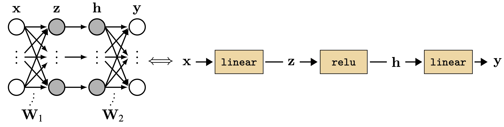{width="60%"}

Each layer: **forward** pass transforms inputs → outputs

## The Learning Problem

Given a layer with parameters $\theta$, find values that minimize loss $J$

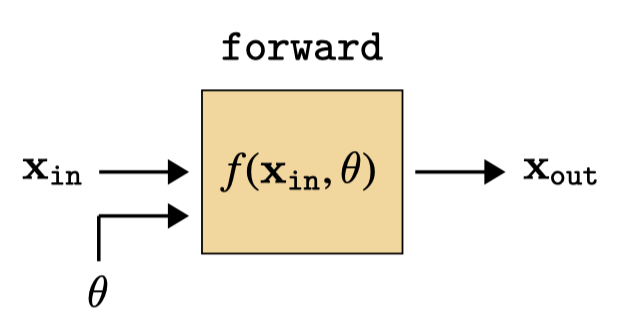{width="55%"}

**Question**: How do we compute $\frac{\partial J}{\partial \theta}$ for *every* parameter efficiently?

## Color Coding in Diagrams

Throughout these slides:

- <span style="background-color: #4DB3FF; padding: 2px 10px;">Blue</span>: Free parameters (learned)
- <span style="background-color: #72E254; padding: 2px 10px;">Green</span>: Data/activations (forward direction)
- <span style="background-color: #D3443D; padding: 2px 10px;">Red</span>: Gradients (backward direction)
- <span style="background-color: #F7E059; padding: 2px 10px;">Yellow</span>: Parameter gradients

# The Key Trick

## Naive Approach: Compute Each Gradient Separately

For chain $f_L \circ f_{L-1} \circ \cdots \circ f_1$ with parameters $\theta_1, \theta_2, \ldots, \theta_L$:

$$\frac{\partial J}{\partial \theta_1} = \frac{\partial J}{\partial \mathbf{x}_L}\frac{\partial \mathbf{x}_L}{\partial \mathbf{x}_{L-1}} \cdots \frac{\partial \mathbf{x}_3}{\partial \mathbf{x}_2}\frac{\partial \mathbf{x}_2}{\mathbf{x}_1}\frac{\partial \mathbf{x}_1}{\partial \theta_1}$$

$$\frac{\partial J}{\partial \theta_2} = \frac{\partial J}{\partial \mathbf{x}_L}\frac{\partial \mathbf{x}_L}{\partial \mathbf{x}_{L-1}} \cdots \frac{\partial \mathbf{x}_3}{\partial \mathbf{x}_2}\frac{\partial \mathbf{x}_2}{\partial \theta_2}$$

**Problem**: Repeated computation! (All the gray terms are shared)

## Backpropagation: Reuse Shared Terms

Compute shared terms once, reuse for all parameter gradients

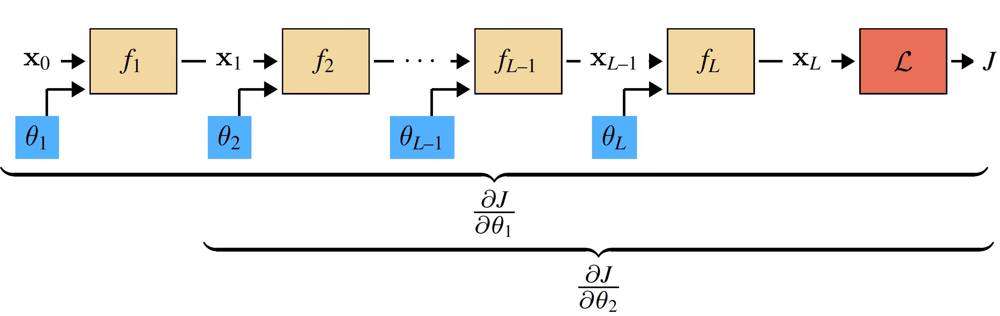{width="95%"}

This is **dynamic programming** for gradient computation

# The Backward Pass

## Key Definitions

For any layer with input $\mathbf{x}_{\texttt{in}}$, output $\mathbf{x}_{\texttt{out}}$, parameters $\theta$:

$$\mathbf{g}_l \triangleq \frac{\partial J}{\partial \mathbf{x}_l} \quad \text{(gradient of loss w.r.t. layer output)}$$

$$\mathbf{L}^{\mathbf{x}} \triangleq \frac{\partial \mathbf{x}_{\texttt{out}}}{\partial \mathbf{x}_{\texttt{in}}} \quad \mathbf{L}^{\theta} \triangleq \frac{\partial \mathbf{x}_{\texttt{out}}}{\partial \theta} \quad \text{(layer Jacobians)}$$

## The Backward Operation

Two key equations for each layer:

$$\mathbf{g}_{\texttt{in}} = \mathbf{g}_{\texttt{out}}\mathbf{L}^{\mathbf{x}} \quad \text{(backprop errors)}$$

$$\frac{\partial J}{\partial \theta} = \mathbf{g}_{\texttt{out}}\mathbf{L}^{\theta} \quad \text{(parameter gradient)}$$

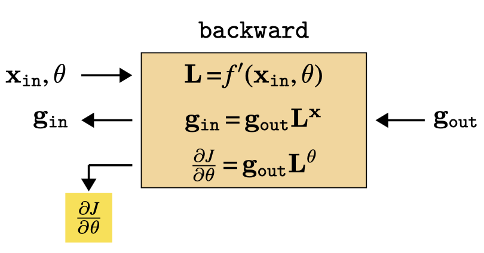{width="55%"}

## Generic Layer

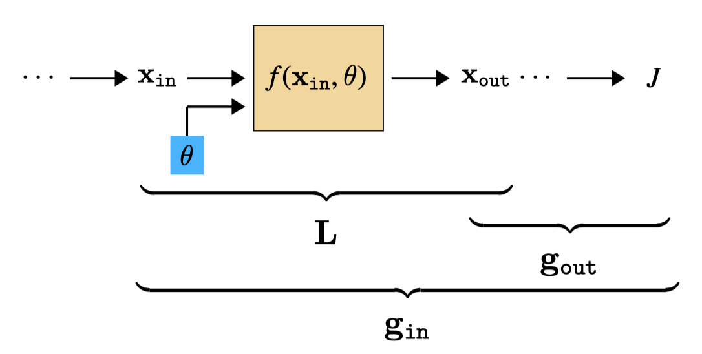{width="80%"}

`backward` takes $(\mathbf{x}_{\texttt{in}}, \theta, \mathbf{g}_{\texttt{out}})$ → outputs $(\mathbf{g}_{\texttt{in}}, \frac{\partial J}{\partial \theta})$

# The Full Algorithm

## Forward Pass

Compute all activations from input to loss

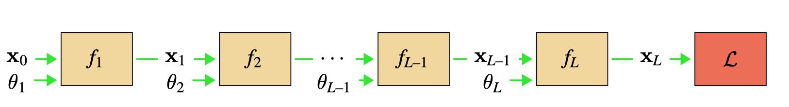{width="100%"}

**Key**: Store $\mathbf{x}_{\texttt{in}}$ and $\theta$ at each layer — needed to compute $\mathbf{L}$ during backward!

## Backward Pass

Compute gradients from loss back to inputs

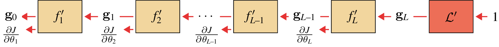{width="100%"}

## Complete Algorithm

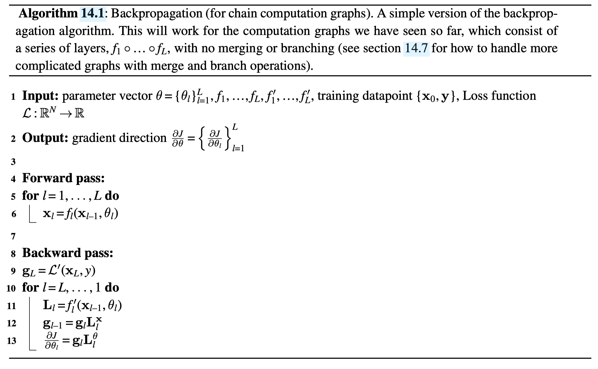{width="100%"}

## Batches: Gradient of Average is Average of Gradients

For training set $\{\mathbf{x}^{(i)}\}_{i=1}^N$:

$$\frac{\partial \frac{1}{N}\sum_{i=1}^N J_i(\theta)}{\partial \theta} = \frac{1}{N} \sum_{i=1}^N \frac{\partial J_i(\theta)}{\partial \theta}$$

**Implementation**: Run backprop on each sample in batch (parallel), then average parameter gradients

# Example: MLP Layers

## Linear Layer: Forward

$$\mathbf{x}_{\texttt{out}} = \mathbf{W}\mathbf{x}_{\texttt{in}} + \mathbf{b}$$

**Jacobians**:
$$\mathbf{L}^{\mathbf{x}} = \mathbf{W} \quad \mathbf{L}^{\mathbf{b}} = \mathbf{I}$$

## Linear Layer: Backward

**Gradient propagation**: $\mathbf{g}_{\texttt{in}} = \mathbf{g}_{\texttt{out}}\mathbf{W}$

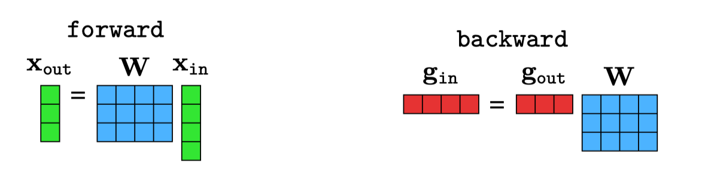{width="85%"}

## Linear Layer: Weight Gradient is an Outer Product

**Parameter gradient**: $\frac{\partial J}{\partial \mathbf{W}} = \mathbf{x}_{\texttt{in}}\mathbf{g}_{\texttt{out}}$

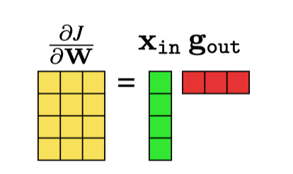{width="20%"}

Outer product between input activations and output gradients

## Linear Layer Complete

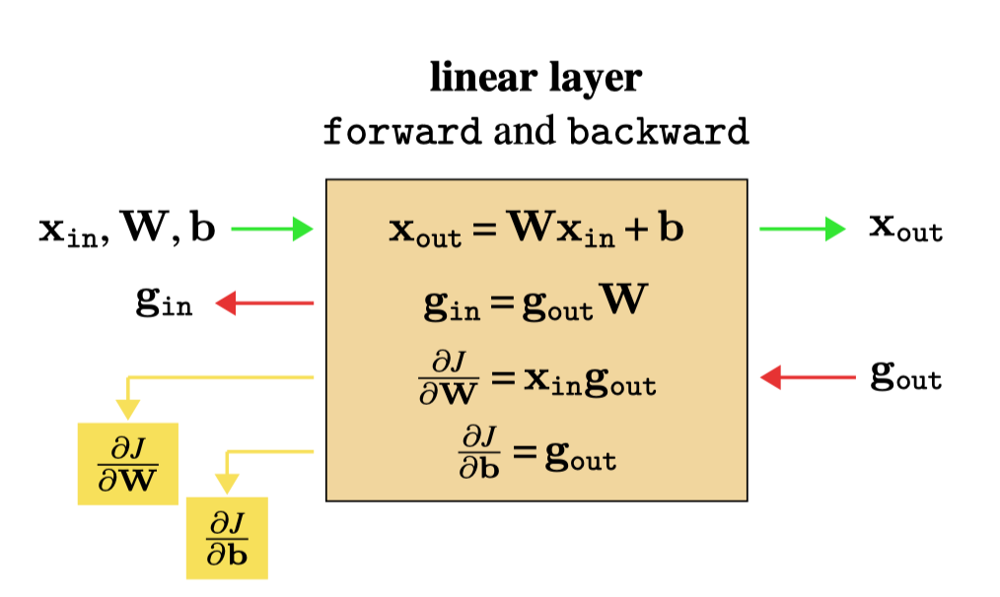{width="75%"}

Simple matrix operations: forward ↔ backward symmetric (with transpose)

## Linear Layer: PyTorch-like Code

```python
class linear():
    def forward(self, x_in):
        self.x_in = x_in  # Store for backward!
        return matmul(W, x_in) + b
    
    def backward(self, g_out):
        g_in = matmul(g_out, W)         # Propagate gradients
        dJdW = matmul(self.x_in, g_out) # Outer product
        dJdb = g_out                    # Direct copy
        return g_in, dJdW, dJdb
    
    def update(self, dJdW, dJdb, lr):
        self.W -= lr * dJdW.T
        self.b -= lr * dJdb
```

## Pointwise Nonlinearity

For $\mathbf{x}_{\texttt{out}}[i] = h(\mathbf{x}_{\texttt{in}}[i])$ (e.g., ReLU):

$$\mathbf{g}_{\texttt{in}}[i] = \mathbf{g}_{\texttt{out}}[i] \cdot h'(\mathbf{x}_{\texttt{in}}[i])$$

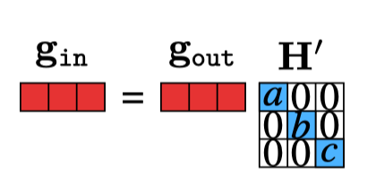{width="18%"}

**ReLU**: $h'(x) = \begin{cases} 1 & x \geq 0 \\\\ 0 & \text{otherwise} \end{cases}$ → gates gradients where input was negative

## Pointwise Layer Complete

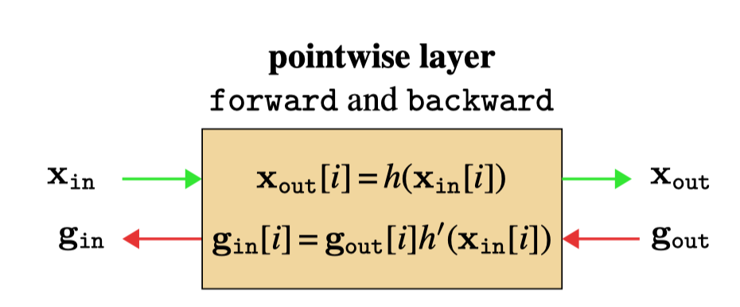{width="75%"}

## Loss Layer (L2)

$$J = \|\hat{\mathbf{y}} - \mathbf{y}\|^2_2$$

**Backward**: $\mathbf{g}_{\texttt{in}} = 2(\hat{\mathbf{y}} - \mathbf{y})$

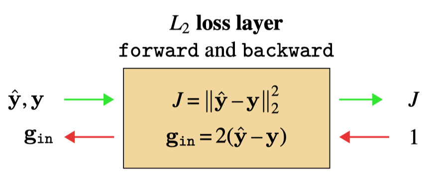{width="75%"}

Error signal: difference between prediction and target

# Putting It Together

## Forward Through MLP

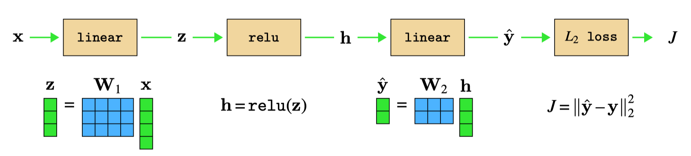{width="100%"}

## Backward Through MLP

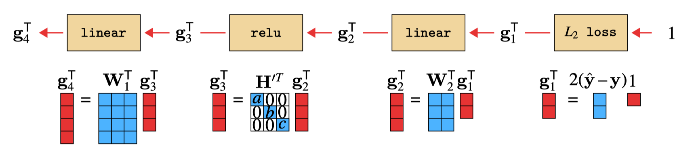{width="100%"}

Linear layers: backward = forward with transposed weights!

## Backprop As A Neural Network

Forward + Backward = one big computation graph

{width="100%"}

Backward pass is a **hypernetwork** [@ha2016hypernetworks] parameterized by forward activations

**Key insight**: Backward network is *always* linear layers (chain rule = products of Jacobians)

# Beyond Chains

## Branch and Merge

For general computation graphs (DAGs), need two operations:

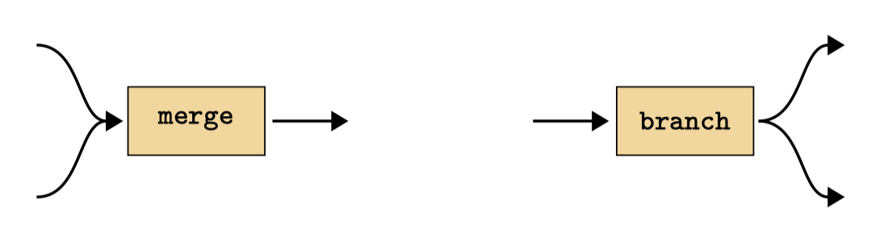{width="65%"}

**Branch**: Copy variable → sum gradients | **Merge**: Concatenate → split gradients

## Branch and Merge Complete

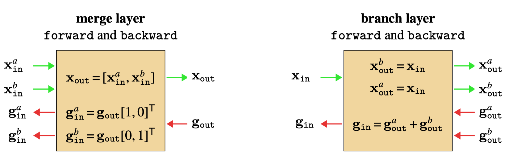{width="95%"}

## Example DAG

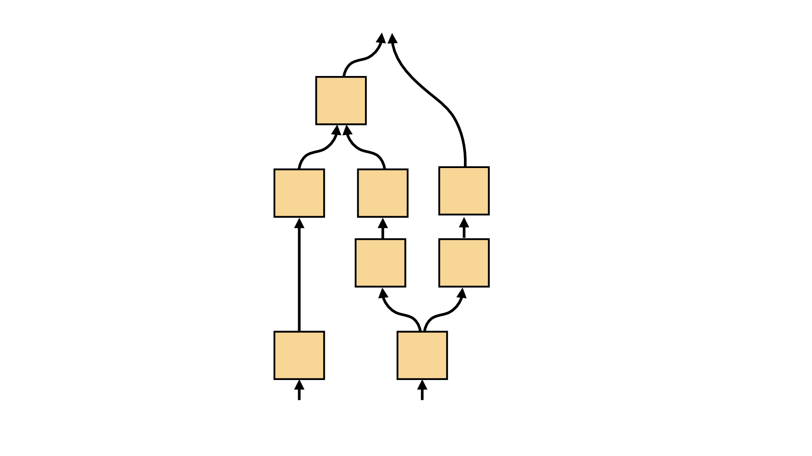{width="30%"}

Can handle arbitrary directed acyclic graphs

## Parameter Sharing

Shared parameters = branching in computation graph

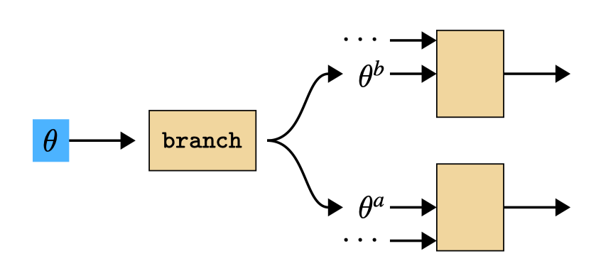{width="55%"}

Gradients sum: $\frac{\partial J}{\partial \theta} = \sum_i \frac{\partial J}{\partial \theta^i}$

# Applications

## Backprop to the Data

Can optimize *inputs* not just parameters!

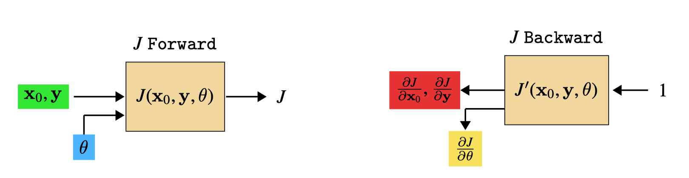{width="100%"}

Data and parameters are symmetric in the computation graph

## Example: Visualizing Features

Find input image that maximally activates a neuron [@radford2021learning; @olah2017feature]

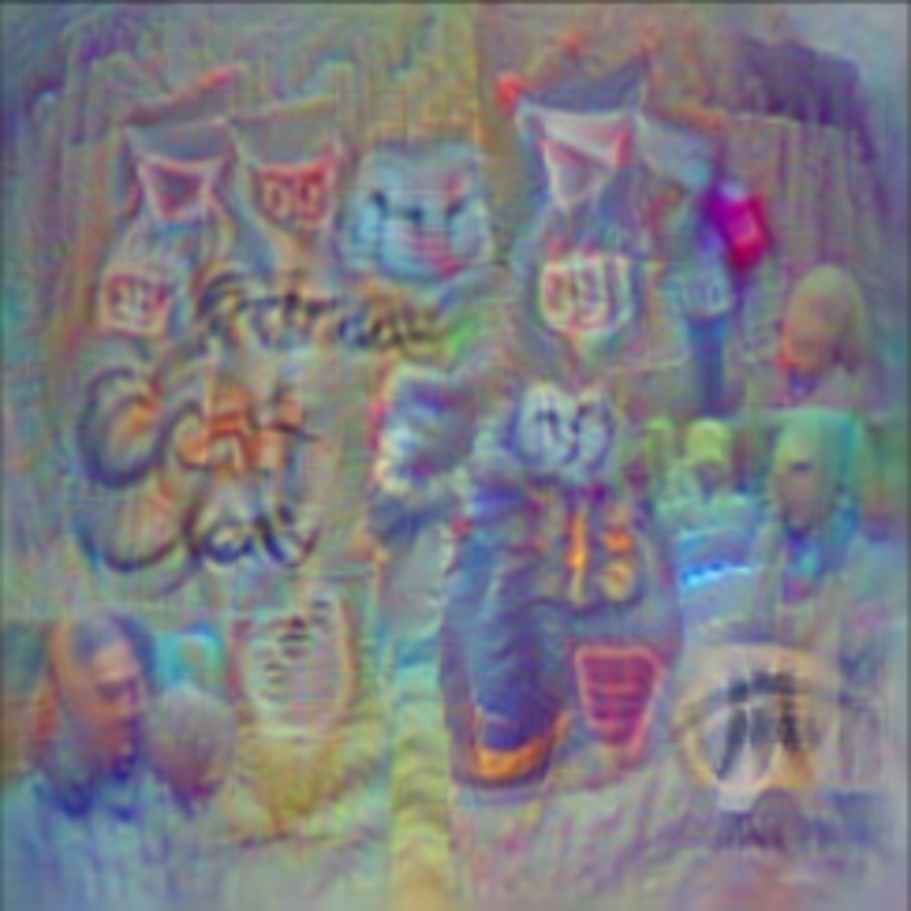{width="55%"}

Optimize $\mathbf{x}_0$ to minimize $J = -x_l[i]$ (maximize activation)

## Summary

- **Backpropagation**: Efficient gradient computation via dynamic programming
- **Key idea**: Reuse shared terms in chain rule
- **Modular**: Each layer defines `forward` and `backward` independently
- **General**: Works for any differentiable computation graph (DAGs)
- **Applications**: Parameter learning, data optimization, feature visualization

## References

::: {#refs}
:::
