# Introduction

## What Are We Learning Today?

::: {.incremental}

- How **light spectra** relate to perceived color
- How surfaces and illumination shape the spectrum reaching the eye
- Why 3 cone types imply 3-number color descriptions (L/M/S)
- **Metamers** and the limits of 3D color measurements
- How to design a **color reproduction system** (sensors + primaries)
- Standard spaces: **CIE XYZ** and chromaticity
- Why spatial detail interacts with color (RGB vs Lab)

:::

## Why Care About Color?

::: {.incremental}

- Detect ripeness, health, and material differences
- Segment objects in clutter
- Communicate appearance across cameras / displays / printers

:::

# Color Physics

## Newton and the Spectrum

White light can be decomposed into elemental colors.

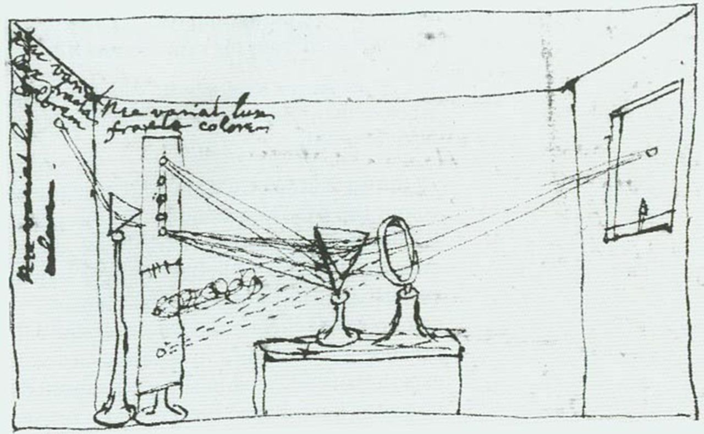{width="100%"}

## Light as Wavelength Mixtures

::: {.incremental}

- Light = electromagnetic waves across wavelengths
- Visible band is roughly **400–700 nm** (blue → red)
- Prisms separate wavelengths via **refraction**
- Gratings/CDs separate wavelengths via **diffraction**

:::

## A Simple Spectrograph

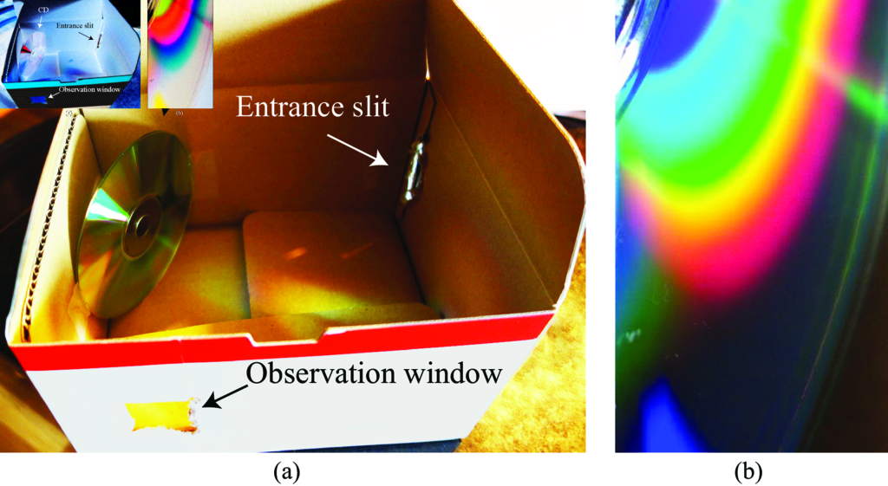{width="90%"}

## Spectra in the Real World

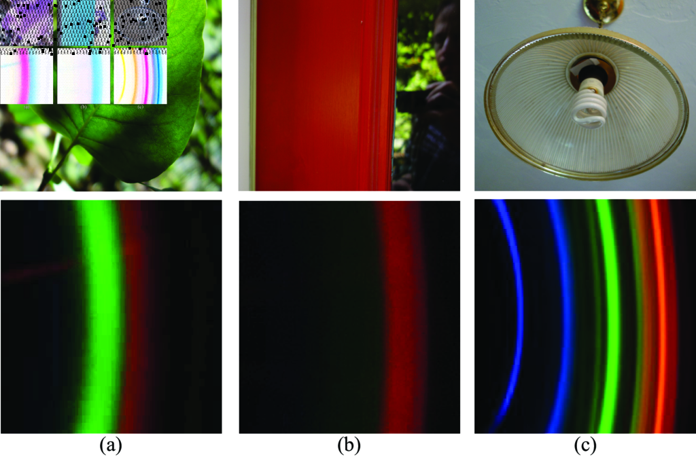{width="90%"}

## Power Spectrum

The **power spectrum** is intensity as a function of wavelength.

::: {.incremental}

- A spectrum is high-dimensional (many wavelengths)
- Color perception depends on context, but spectrum is a key driver

:::

## Example: Blue Sky Spectrum

::: {#fig-sky layout-ncol="2"}

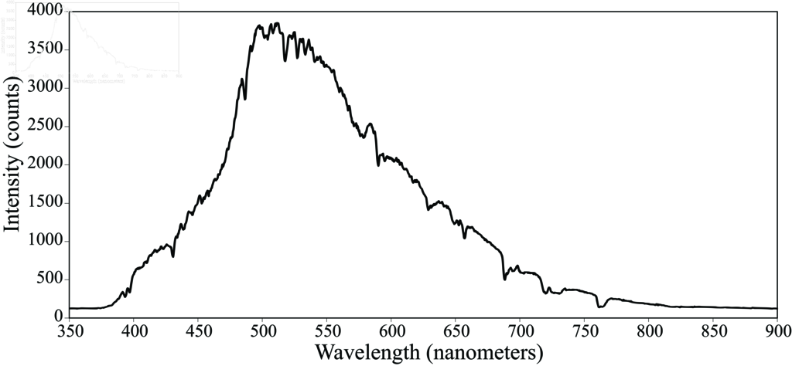{width="80%"}

{width="18%"}

Power spectrum of blue skylight.

:::

## Approximate Colors of Spectral Bands

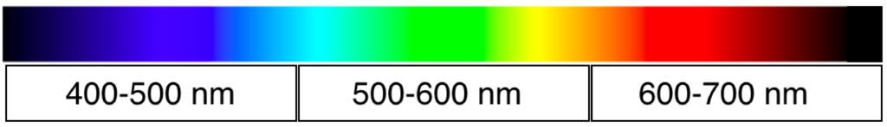{width="90%"}

## 3-Band Cartoon Model

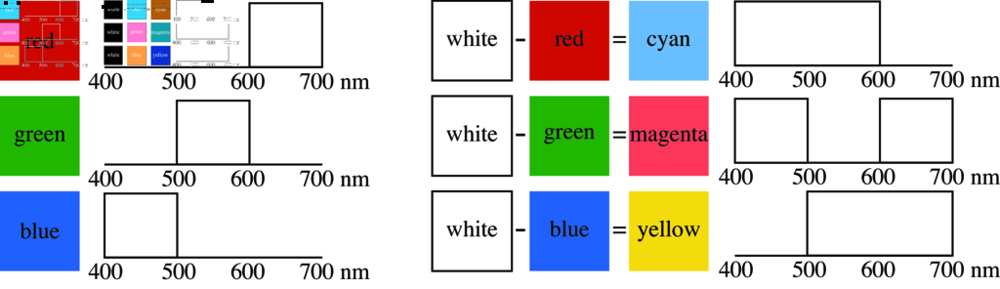{width="85%"}

## Light Reflecting from Surfaces

Diffuse reflection model:

$$
r(\lambda) = k\,\ell_{\texttt{in}}(\lambda)\,s(\lambda)
$$

::: {.incremental}

- Observed spectrum = illumination spectrum × surface reflectance spectrum
- This is also a good model for transmission through an attenuating filter

:::

## Reflectance Spectra Example

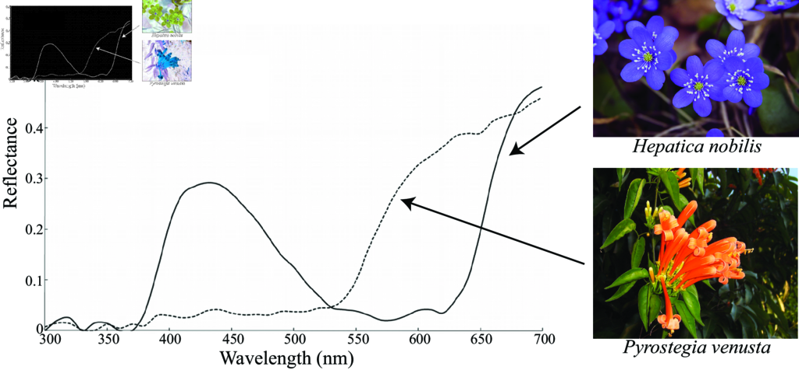{width="85%"}

## Illumination Ambiguity: #TheDress

::: {#fig-dress layout-ncol="2"}

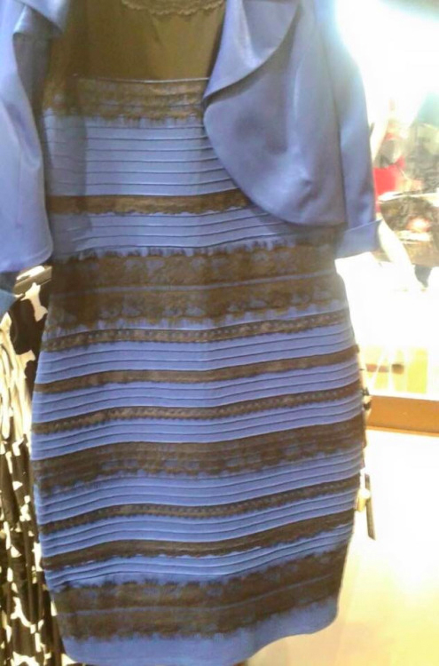{width="45%"}

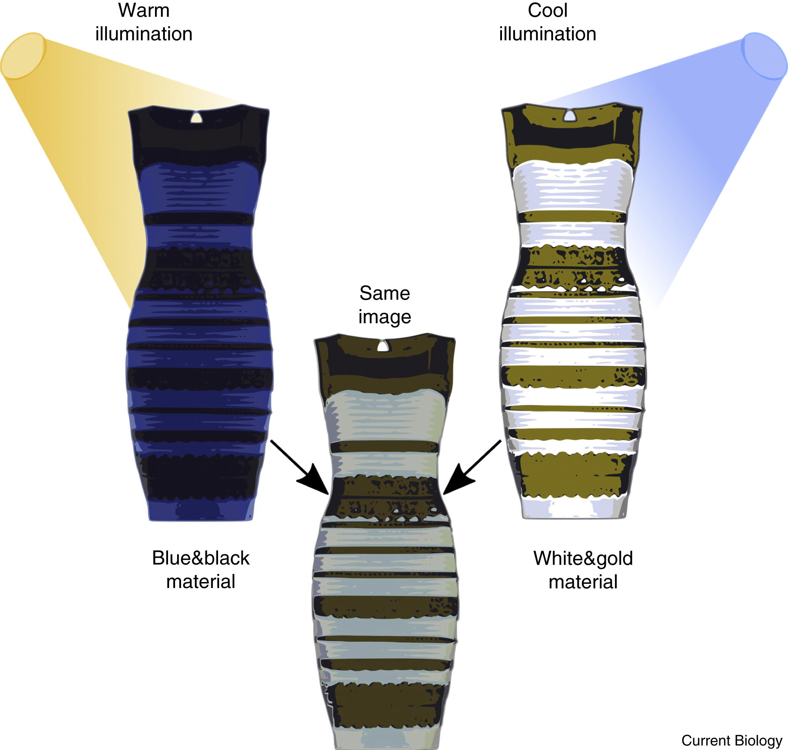{width="55%"}

:::

::: {.incremental}

- Different assumptions about illumination ⇒ different perceived colors
- Same measured spectrum can be explained by different (illumination, reflectance) pairs

:::

# Color Perception

## Three Cone Classes (L, M, S)

We can model cone responses as a linear projection of the spectrum:

$$
\begin{bmatrix}L\\M\\S\end{bmatrix} = \mathbf{C}_{\text{eye}}\,\mathbf{t}
$$

## Cones in Space and Wavelength

::: {#fig-cones layout-ncol="2"}

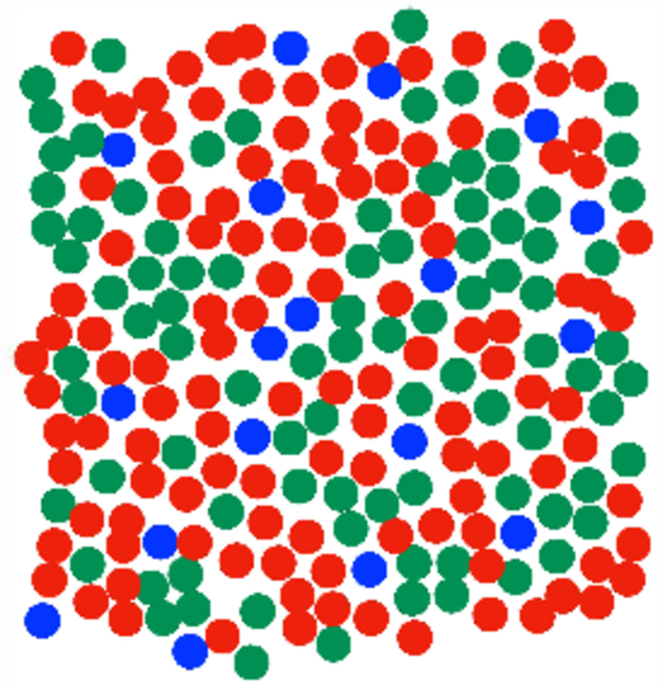{width="100%"}

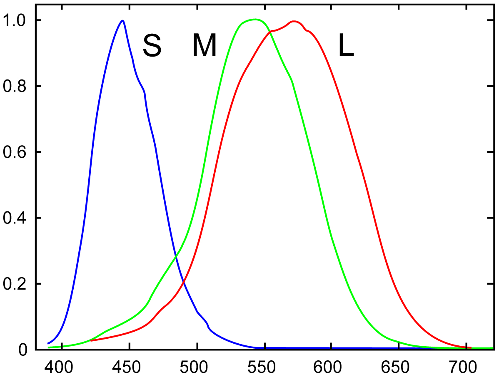{width="100%"}

:::

::: {.incremental}

- Cones are spatially interleaved (roughly hex packing)
- S cones are much sparser than L/M
- Each cone type is a different spectral weighting

:::

# Color Matching

## Color Matching Idea

::: {.incremental}

- Any perceived color can be matched by a linear combination of **three primaries**
- The required primary weights can serve as **color coordinates**
- Not every color is producible with positive weights (device **gamut**)

:::

## Metamerism

::: {.incremental}

- Two different spectra can look identical if they yield the same 3 cone projections
- Many-to-one mapping: high-dimensional spectra → 3D responses

:::

## Linear Algebra View of Color Measurement

A color space is defined by three sensitivity curves (rows of $\mathbf{C}$):

$$
\mathbf{C} = \mathbf{R}\,\mathbf{C}_{\text{eye}}
$$

where $\mathbf{R}$ is any full-rank $3\times 3$ change of basis.

## A Color Reproduction System

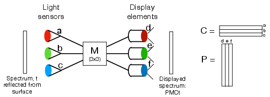{width="95%"}

## Condition for Color Match

To match the eye’s response for all spectra $\mathbf{t}$:

$$
\mathbf{C}_{\text{eye}}\,\mathbf{P}\,\mathbf{M}\,\mathbf{C} = \mathbf{C}_{\text{eye}}
$$

## Practical Conditions

With $\mathbf{C} = \mathbf{R}\,\mathbf{C}_{\text{eye}}$:

$$
\mathbf{M} = (\mathbf{C}\mathbf{P})^{-1}
$$

::: {.incremental}

- Sensor curves must span the same 3D subspace as the eye
- Given primaries $\mathbf{P}$ and sensors $\mathbf{C}$, $\mathbf{M}$ is determined

:::

## Example: Valid $\mathbf{C}$ and $\mathbf{P}$

::: {#fig-example-cp layout-ncol="2"}

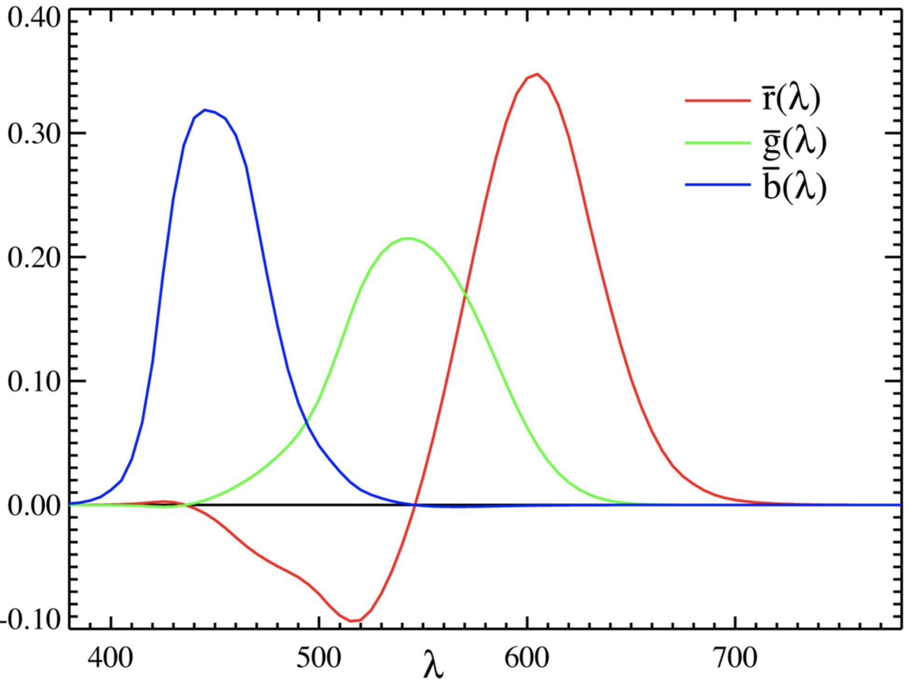{width="95%"}

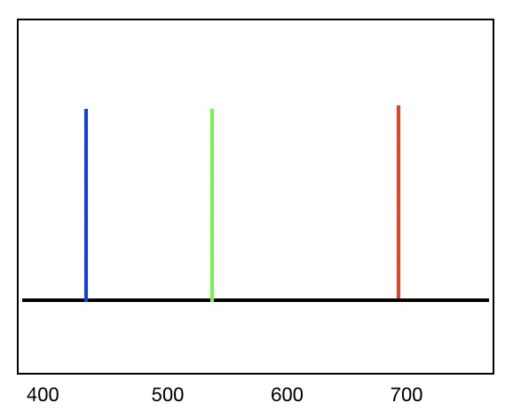{width="95%"}

:::

# Standard Color Spaces

## CIE XYZ Color Matching Functions

The CIE functions are all-positive over wavelength:

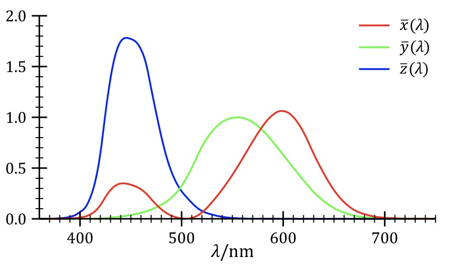{width="85%"}

## Tristimulus and Chromaticity

Given a spectrum, compute tristimulus values $(X,Y,Z)$ via projection.

Often normalize for chromaticity:

$$
x = \frac{X}{X+Y+Z},\qquad y = \frac{Y}{X+Y+Z}
$$

# Spatial Resolution and Color

## RGB: Blur Individual Channels

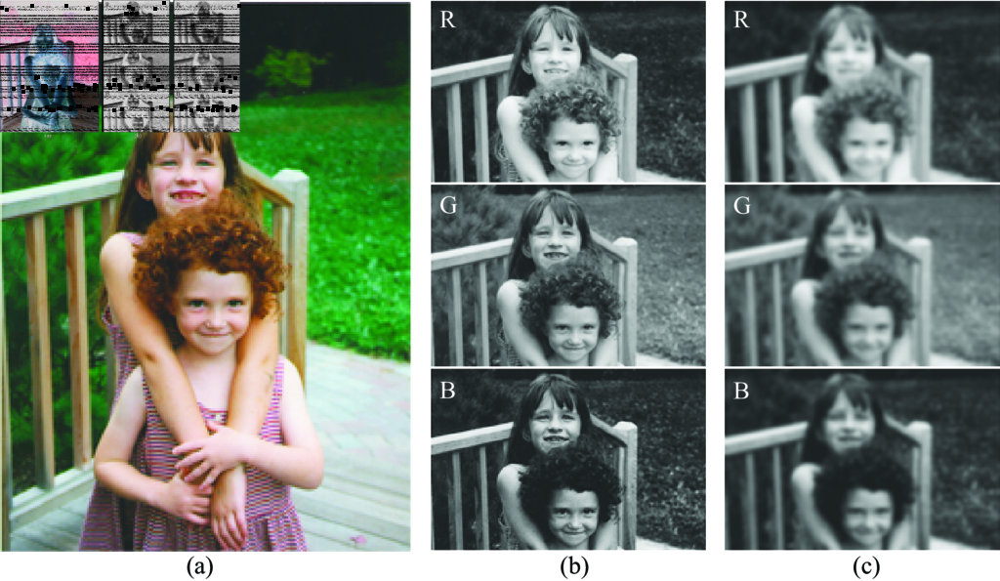{width="95%"}

## RGB: Perceptual Effect

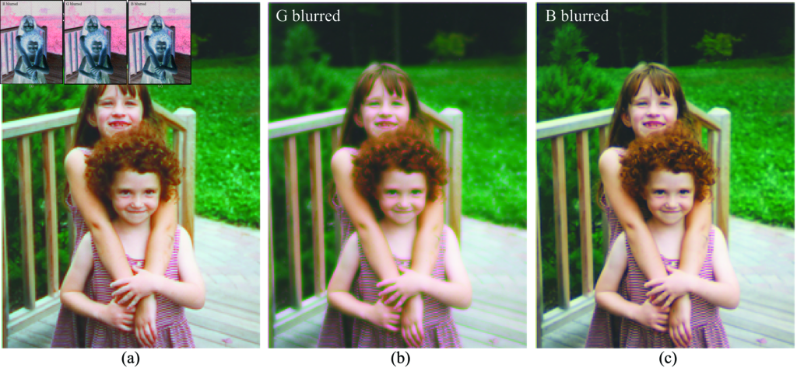{width="95%"}

## Lab: Rotate Color Coordinates

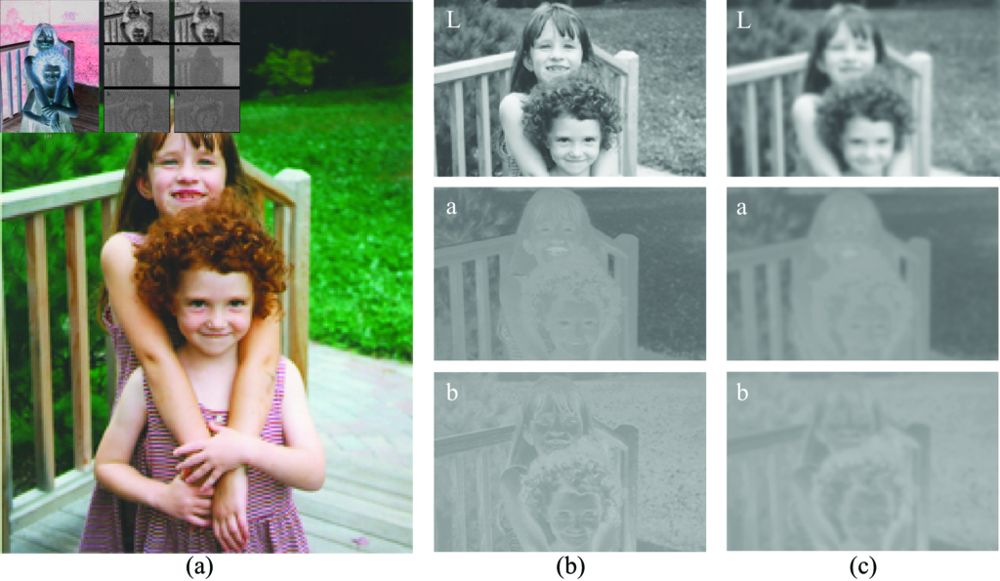{width="95%"}

## Lab: Luminance Dominates Sharpness

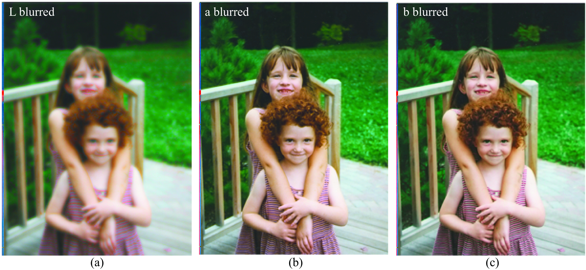{width="95%"}

::: {.incremental}

- Human vision is more sensitive to high-frequency detail in luminance
- Compression exploits this: sample chroma more coarsely than luminance

:::

# Wrap-Up

## Key Takeaways

::: {.incremental}

- Spectra are high-dimensional; vision compresses them to 3 cone responses
- Illumination × reflectance makes color inference context-dependent
- Metamers: different spectra can look identical
- Color reproduction can be expressed with linear algebra: $\mathbf{C}$, $\mathbf{P}$, $\mathbf{M}$
- CIE XYZ provides a standardized way to represent colors
- Spatial resolution differs across color directions (RGB vs Lab)

:::
