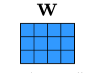
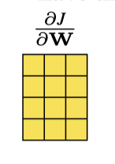

# Notation

This book deals with many different fields and each has its own notation. We will stick to the following conventions throughout most of this book, and indicate when we deviate from these rules.

## General notation

!!! info inline end ""
    We will use margin notes to bring attention into important concepts, or to add additional comments without breaking the flow of the main text.
    
    A 3D tensor that could represent an $C \times H \times W$ color image.

- Scalar: $x, y, z$
- Vector: $\mathbf{x}, \mathbf{y}, \mathbf{z}$. We use bold letters to represent vectors and matrices.
- Index of a vector: $x_{i}, x_{j}, y_{i}$, or $x[i]$
- Matrix or tensor: $\mathbf{X}, \mathbf{Y}, \mathbf{Z}$. We use bold letters to represent vectors and matrices.
- Index of a matrix/tensor: $X_{i j}, Y_{j k}, Z_{i i}$, or $T[i, j, k]$
- For an indexed matrix $X_{i j}$ or $X[i, j], i$ indexes rows and $j$ indexes columns. We use non bold font because $X_{i j}$ and $X[i, j]$ are scalars.
- Slice of a matrix/tensor: $\mathbf{X}_{i}$ or $\mathbf{X}[i,:]$; for slicing intermediate indices: $\mathbf{T}[i,:, k, l, m, n]$. 

Here is one example:

$$
\mathbf{X}=\left[\begin{array}{ll}
1 & 2 \\
3 & 4 \\
5 & 6
\end{array}\right] \quad \mathbf{X}[2,:]=\left[\begin{array}{ll}
3 & 4
\end{array}\right]
$$

- A set of $N$ datapoints: $\left\{x^{(i)}\right\}_{i=1}^{N},\left\{\mathbf{x}^{(i)}\right\}_{i=1}^{N},\left\{\mathbf{X}^{(i)}\right\}_{i=1}^{N}$
- $\mathbf{A}=[\mathbf{x}, \mathbf{y}, \mathbf{z}]$ concatenates column vectors $\mathbf{x}, \mathbf{y}, \mathbf{z}$ as columns of matrix $A . \mathbf{A}=$ $\left[\mathbf{x}^{T}, \mathbf{y}^{T}, \mathbf{z}^{T}\right]$ concatenates these vectors as rows of $\mathbf{A}$.

!!! info inline end ""
    In the geometry chapters, and in some other chapters, the variables $x$, $y, z$ will denote location and will have a special treatment. 

## Signal processing

- Discrete signals (and images) are vectors $\mathbf{x}, \mathbf{y}, \mathbf{z}$.
- Discrete signals. When indexing a discrete signal we will use brackets: $x[n]$, where $n$ is a discrete index.
- Continuous signals $x(t)$, where $t$ is a continuous variable.
- Convolution operator: $\circ$
- Cross-correlation operator: $\star$
- Discrete Fourier transforms: $X[u]$, where $u$ is a discrete frequency index.

## Images
!!! inline end ""
    We will use the letter $\ell$, from $\ell$ ight, when the signal is an image. We use this letter because it is very distinct to all the other notation. But sometimes we will use other notation if it is more convenient.

Images are a very special signal and, whenever is convenient, we will use the following notation:

- Image as a discrete 2D signal: $\ell[n, m]$ where $n$ indexes columns and $m$ indexes rows. The origin, $n=m=0$, corresponds to the bottom-left side of the image unless we specify a different convention. An image has a size $N \times M, N$ columns and $M$ rows.
- Image as a matrix: $\ell$ of size $M \times N, M$ rows and $N$ columns, which can be indexed as $\ell_{i j}$.
- The Fourier transform on an image: $\mathscr{L}[u, v]$, where $u$ and $v$ are spatial frequencies.

Note that the way matrices and images are indexed is transposed. However, we will rarely represent images as a arrays. If we do, we will use the general notation and the images will be just generic signals, $\mathbf{x}, \mathbf{y}, \mathbf{z}$.

## Machine learning

- Total loss function / cost function / objective function: $J$
- Per-datapoint loss function: $\mathcal{L}$
- Generic learnable parameters: $\theta$

## Neural nets
!!! inline end ""
    

- Parameters: $\theta$. These include weights, $\mathbf{W}$, and biases, $\mathbf{b}$, as well as any other learnable parameters of a network.
- Data: x. Data can refer to inputs to the network, activations on hidden layers, outputs from the network, and so on. Any representation of the signal being processed is considered to be data. Sometimes we will wish to distinguish between the raw inputs, hidden units, and outputs to a network, in which case we will use $\mathbf{x}, \mathbf{h}$, and $\mathbf{y}$ respectively. When we need to to distinguish between pre-activation hidden units and postactivation, we will use $\mathbf{z}$ for pre-activation and $\mathbf{h}$ for postactivation.
- Neuron values on layer $l$ of a deep net: $\mathbf{x}_{l}$
- $\mathrm{x}_{l_{i}}$ refers to the $i$-th neuron on layer $l$.
- For a $\mathrm{CNN}, \mathrm{x}_{l}[i, j, c]$ refers to the $i j c$-th neuron on layer $l$, where $i$ and $j$ index spatial position in a feature map, and $c$ indexes the channel.
- The layer $l$ neural representation of the $i$-th datapoint in a dataset is written as $\mathbf{x}_{l}^{(i)}$.
- We will also use $\mathbf{x}_{\text {in }}$ and $\mathbf{x}_{\text {out }}$ when we are describing a particular layer or module in a neural net and wish to speak of its inputs and outputs without having to keep track of layer indices.

## Probabilities

We will sometimes not distinguish between random variables and realizations of those variables; which we mean should be clear from context. When it is important to make a distinction, we will use nonbold capital letters to refer to random variables and lowercase to refer to realizations. Suppose $X, Y$ are discrete random variables and $\mathbf{x}, \mathbf{y}$ are realizations of those variables. $X$ and $Y$ may take on values in the sets $\mathcal{X}$ and $\mathcal{Y}$, respectively.

- $a=p(X=\mathrm{x} \mid \ldots)$ is the probability of the realization $X=\mathrm{x}$, possibly conditioned on some observations ( $a$ is a scalar).
- $f=p(X \mid \ldots)$ is the probability distribution over $X$, possibly conditioned on some observations ( $f$ is a function: $f: \mathcal{X} \rightarrow \mathbb{R}$ ). If $\mathcal{X}$ is discrete, $f$ is the probability mass function. If $\mathcal{X}$ is continuous, $f$ is the probability density function.
- $p(\mathrm{x} \mid \ldots)$ is shorthand for $p(X=\mathrm{x} \mid \ldots)$. and so forth, following these patterns.
- Suppose we have defined a named distribution, for example, $p_{\theta}$, for some random variable $X$; then referring to $p_{\theta}$ on its own is shorthand for $p_{\theta}(X)$.

For continuous random variables, all the above notations hold except that they refer to probability densities and probability density functions rather than probabilities and probability distributions. We will sometimes use the term probability distribution when referring to continuous distributions, and in those cases this should be understood to refer to a probability density function.

## Matrix calculus conventions

In this book, we adopt the following conventions for matrix calculus. These conventions make the equations simpler, and that also means simpler implementations when it comes to actually writing these equations in code. Everything in this section is just definitions. There is no right or wrong to it. We could have used other conventions but we will see that these are useful ones.

Vectors are represented as column vectors with shape $[N \times 1]$ :

$$
\mathbf{x} \triangleq\left[\begin{array}{c}
x_{1} \\
x_{2} \\
\vdots \\
x_{N}
\end{array}\right]
$$

If $y$ is a scalar and $\mathbf{x}$ is an $N$-dimensional vector, then the gradient $\frac{\partial y}{\partial \mathbf{x}}$ is a row vector of shape $[1 \times N]$ :

$$
\frac{\partial y}{\partial \mathbf{x}} \triangleq\left[\begin{array}{llll}
\frac{\partial y}{\partial x_{1}} & \frac{\partial y}{\partial x_{2}} & \cdots & \frac{\partial y}{\partial x_{N}}
\end{array}\right]
$$

If $\mathbf{y}$ is an $M$-dimensional vector and $\mathbf{x}$ is a $N$-dimensional vector then the gradient (also called the Jacobian in this case) is shaped as $[M \times N]$ :

$$
\frac{\partial \mathbf{y}}{\partial \mathbf{x}} \triangleq\left[\begin{array}{cccc}
\frac{\partial y_{1}}{\partial x_{1}} & \frac{\partial y_{1}}{\partial x_{2}} & \cdots & \frac{\partial y_{1}}{\partial x_{N}} \\
\vdots & \vdots & \vdots & \vdots \\
\frac{\partial y_{M}}{\partial x_{1}} & \frac{\partial y_{M}}{\partial x_{2}} & \cdots & \frac{\partial y_{M}}{\partial x_{N}}
\end{array}\right]
$$

Finally, if $\mathbf{W}$ is an $[N \times M]$ dimensional matrix, and $\mathcal{L}$ is a scalar, then the gradient $\frac{\partial \mathcal{L}}{\mathbf{W}}$ is represented as an $[M \times N]$ dimensional matrix (note that the dimensions are transposed from what you might have expected; this makes the math simpler later)
:
!!!inline note end ""
    We will usually draw matrices and vectors to help visualize the operations. For example, if $N=3$ and $M=4$ : 
    
    
    
    then, the gradient will have the form:
    
    
    

$$
\frac{\partial \mathcal{L}}{\partial \mathbf{W}} \triangleq\left[\begin{array}{ccc}
\frac{\partial \mathcal{L}}{\partial \mathbf{W}_{11}} & \cdots & \frac{\partial \mathcal{L}}{\partial \mathbf{W}_{N 1}} \\
\vdots & \ddots & \vdots \\
\frac{\partial \mathcal{L}}{\partial \mathbf{W}_{1 M}} & \cdots & \frac{\partial \mathcal{L}}{\partial \mathbf{W}_{N M}}
\end{array}\right]
$$

## Conventions that will not be strictly observed

- We will often use $\mathbf{x}$ as the input to a function, and $\mathbf{y}$ as the output.
- $f, g$, and $h$ are typically functions. The corresponding function spaces are $\mathcal{F}, \mathcal{G}, \mathcal{H}$.
- Basis functions are $\phi$ and $\psi$.

## Miscellaneous

- The word **dimension** has two usages in the computational sciences. The first usage is as a coordinate in a multivariate data structure, for example, "the $i$-th dimension of a vector" or "a 128-dimensional feature space." The second usage is as the shape of a multidimensional array, as in "a 4D tensor." We will use both these meanings in this book and we hope the usage will be clear from context.