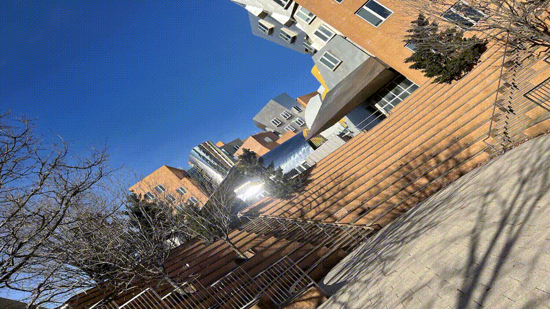
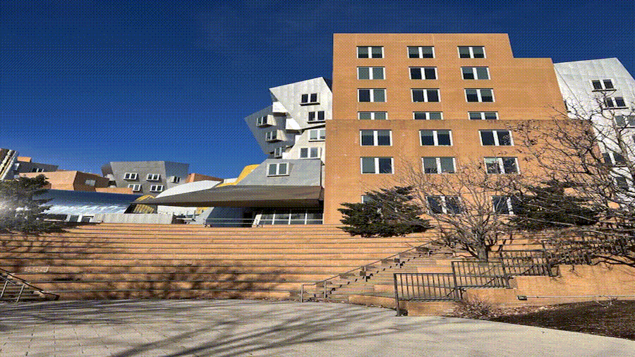
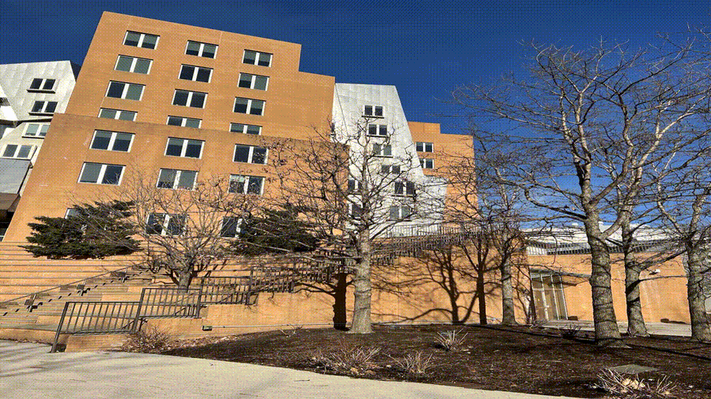
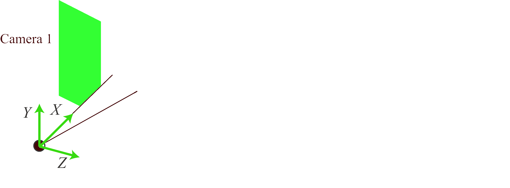
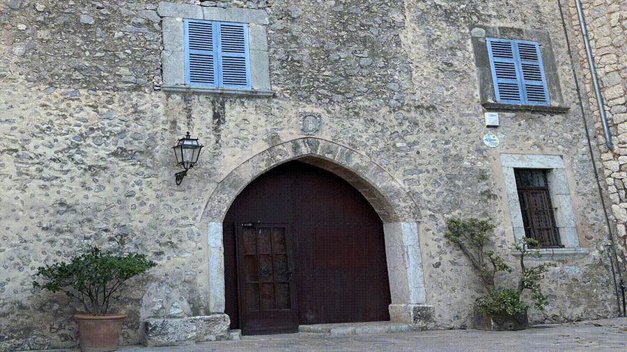
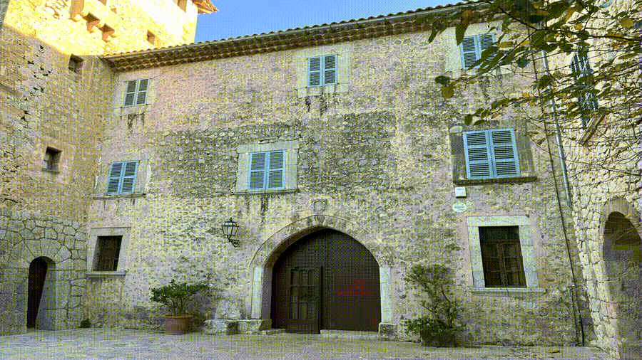
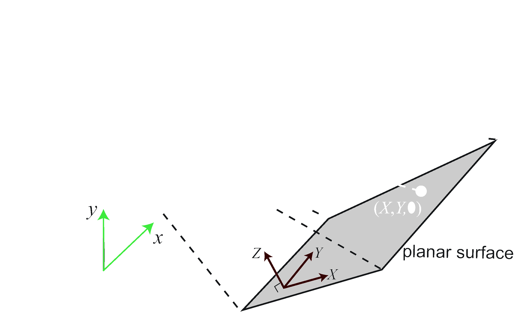
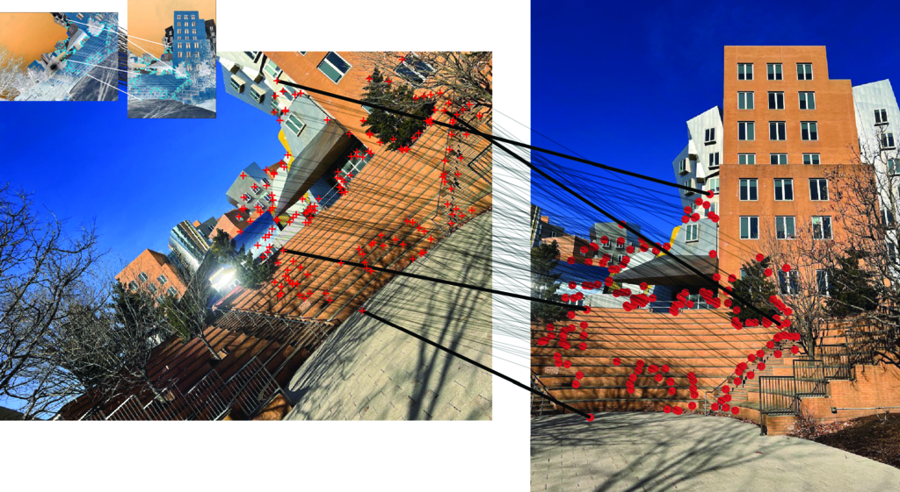
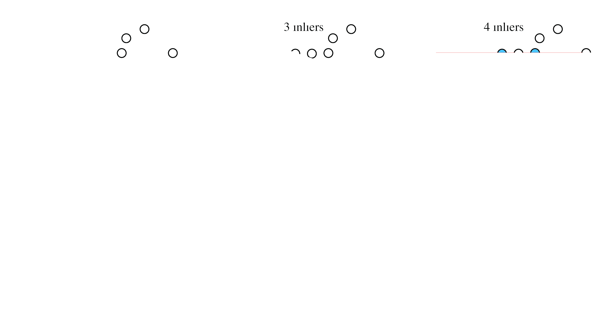
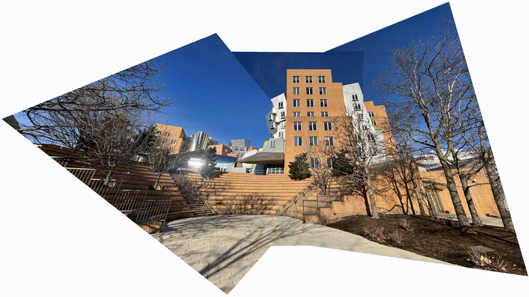

# Introduction

## What Are We Learning Today?

::: {.incremental}

- What is a homography?
- When do homographies occur in real scenes?
- How to estimate homographies from image correspondences
- Practical applications: panorama stitching and beyond

:::

## The Big Picture

Homographies are **simple 2D transformations** that relate images when:

::: {.incremental}
- Two cameras differ only by rotation (same center of projection)
- Observing a planar surface
:::

No knowledge of 3D structure needed!

# What is a Homography?

## Definition

A **homography** (or projective transformation) preserves straight lines:

::: {.incremental}
- If points $\mathbf{p}_1$, $\mathbf{p}_2$, $\mathbf{p}_3$ are collinear
- Then $h(\mathbf{p}_1)$, $h(\mathbf{p}_2)$, $h(\mathbf{p}_3)$ are also collinear
:::

## Matrix Form

In homogeneous coordinates:

$$\begin{bmatrix} x' \\ y' \\ w' \end{bmatrix} = \begin{bmatrix} a & b & c \\ d & e & f \\ g & h & i \end{bmatrix} \begin{bmatrix} x \\ y \\ 1 \end{bmatrix}$$

Or simply: $$\mathbf{p}' = \mathbf{H} \mathbf{p}$$

## Key Properties

::: {.incremental}

- Angles are **NOT preserved**
- Lengths are **NOT preserved**
- Parallel lines may **NOT remain parallel**
- But collinearity is always preserved

:::

## Visual Example

# When Do Homographies Occur?

## Scenario 1: Camera Rotation

:::{layout-ncol="3"}

:::

Three images from rotating a camera in place

## Camera Rotation: Geometry

## Camera Rotation: Math

For a 3D point $\mathbf{P}$ in the world:

**Camera 1 (reference):**
$$\lambda_1 \begin{bmatrix} x \\ y \\ 1 \end{bmatrix} = \mathbf{K} \begin{bmatrix} \mathbf{I} & \mathbf{0} \end{bmatrix} \begin{bmatrix} X \\ Y \\ Z \\ 1 \end{bmatrix}$$

**Camera 2 (rotated):**
$$\lambda_2 \begin{bmatrix} x' \\ y' \\ 1 \end{bmatrix} = \mathbf{K} \begin{bmatrix} \mathbf{R} & \mathbf{0} \end{bmatrix} \begin{bmatrix} X \\ Y \\ Z \\ 1 \end{bmatrix}$$

## Camera Rotation: Result

Combining the two equations:

$$\lambda \begin{bmatrix} x' \\ y' \\ 1 \end{bmatrix} = \mathbf{K} \mathbf{R} \mathbf{K}^{-1} \begin{bmatrix} x \\ y \\ 1 \end{bmatrix}$$

$$\mathbf{H} = \mathbf{K} \mathbf{R} \mathbf{K}^{-1}$$

**Translation is zero** — rotation only!

## Scenario 2: Planar Surfaces

:::{layout-ncol="2"}

:::

Two views of a building facade — coordinates on the plane are related by a homography

## Planar Surface: Geometry

Place the plane at $Z = 0$ in world coordinates

## Planar Surface: Math

Project a 3D point with $Z = 0$:

$$\lambda \begin{bmatrix} x \\ y \\ 1 \end{bmatrix} = \mathbf{K} \begin{bmatrix} \mathbf{c}_1 & \mathbf{c}_2 & \mathbf{t} \end{bmatrix} \begin{bmatrix} X \\ Y \\ 1 \end{bmatrix}$$

This is a product of two $3 \times 3$ matrices:

$$\lambda \begin{bmatrix} x \\ y \\ 1 \end{bmatrix} = \mathbf{H} \begin{bmatrix} X \\ Y \\ 1 \end{bmatrix}$$

**No need to know $Z$ coordinates!**

# Homography Estimation

## Point Correspondences

## Direct Linear Transform (DLT)

Given $N$ corresponding point pairs, solve:

$$\mathbf{A} \mathbf{h} = \mathbf{0}$$

- $\mathbf{A}$ is a $2N \times 9$ matrix
- $\mathbf{h}$ contains the 9 elements of $\mathbf{H}$
- Need at least **4 correspondences** (8 DOF)

## DLT Solution

The solution is the eigenvector of $\mathbf{A}^T\mathbf{A}$ with the smallest eigenvalue

**In practice:** 
- Initialize with DLT
- Refine by minimizing reprojection error

## Robust Fitting: RANSAC

Problem: Feature matching can be **noisy**

Solution: **Random Sampling with Consensus**

## RANSAC Algorithm

1. Randomly select 4 point correspondences
2. Estimate homography $\mathbf{H}$
3. Count inliers (points fitting the model)
4. Repeat $k$ times
5. Select model with most inliers

## RANSAC Example

## How Many Iterations?

If $w$ = probability a point is an inlier:

$$k = \frac{\log(1-p)}{\log(1-w^n)}$$

**Example:** $w = 0.18$, $n = 2$, $p = 0.95$:
$$k = \frac{\log(0.05)}{\log(1-0.18^2)} = 91 \text{ iterations}$$

# Application: Image Panoramas

## Creating Panoramas

**Goal:** Stitch overlapping images into one large image

**Method:**
1. Find correspondences between adjacent images
2. Estimate homography for each pair
3. Use RANSAC for robustness
4. Warp all images to reference frame

## Example Panorama

Created from the three overlapping images using estimated homographies

# Summary

## Key Takeaways

::: {.incremental}

- Homographies relate images when **cameras rotate** or viewing **planar surfaces**
- A **$3 \times 3$ matrix** completely describes the transformation
- Need only **4 point correspondences** to estimate
- Use **RANSAC** for robust estimation with noisy data
- Enables **panorama stitching** and many other applications

:::

## Beyond Panoramas

Homographies also enable:

- Perspective correction
- Augmented reality
- Bird's-eye views
- Keystone distortion correction
- And much more!

## Thank You!
