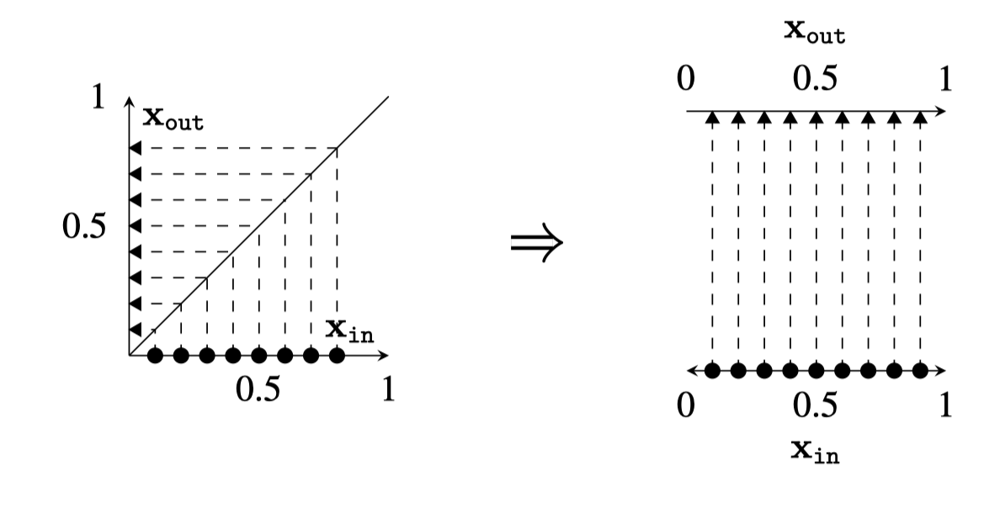
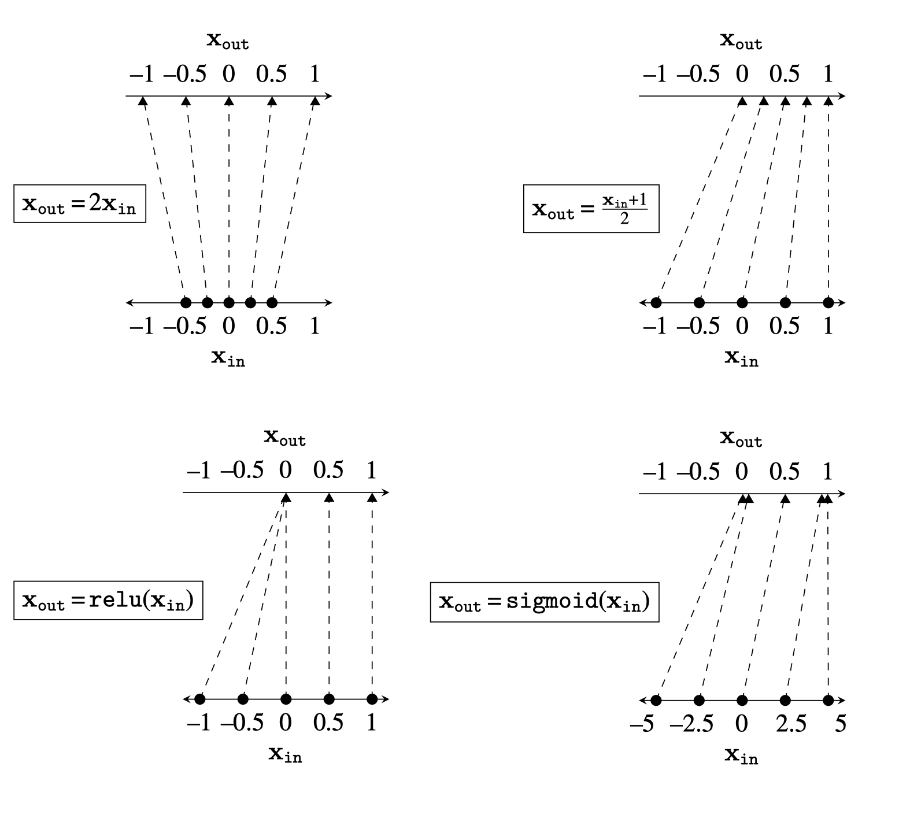
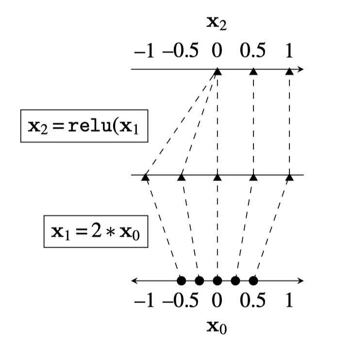
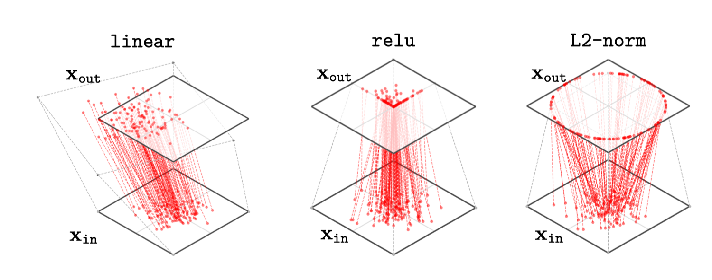
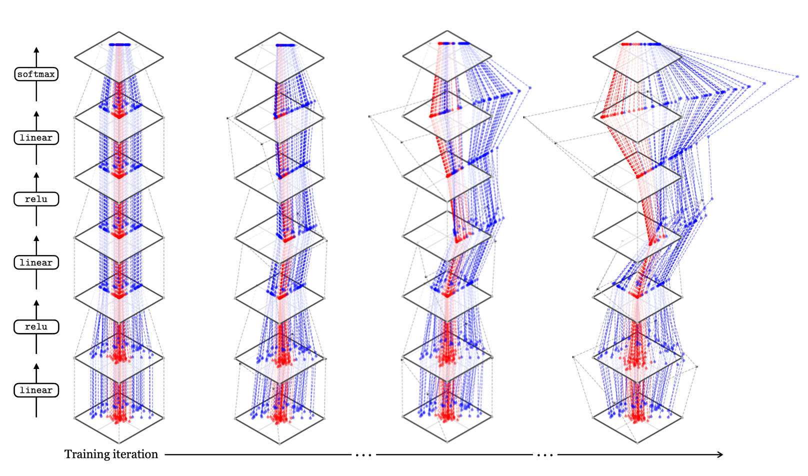
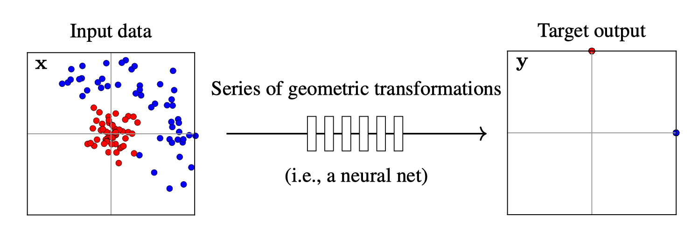
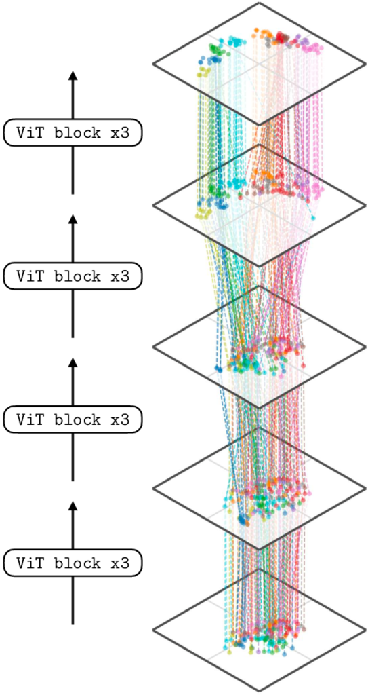

## Introduction

So far we have seen that deep nets are stacks of simple functions, which compose to achieve interesting mappings from inputs to outputs.

**A different way of thinking about deep nets:**
- Each layer is a *geometric transformation of a data distribution*
- We can visualize this by plotting the mapping in 2D space

## A Different Way of Plotting Functions

Each layer in a deep net is a mapping: $f: \mathbf{x}_{\text{in}} \rightarrow \mathbf{x}_{\text{out}}$

**Traditional plot:** $\mathbf{x}_{\text{in}}$ on x-axis, $\mathbf{x}_{\text{out}}$ on y-axis

**Alternative plot:** Rotate the y-axis to be horizontal
- Input space on left (bottom plane)
- Output space on right (top plane)
- Lines connect corresponding points

{width=80%}

## Simple Layer Examples

{width=100%}

- **Linear layers:** stretch, squash, and rotate the data distribution
- **ReLU:** maps all negative data to 0, applies identity to nonnegative data
- **Sigmoid:** pulls negative data to 0, positive data to 1

## How Deep Nets Remap a Data Distribution

An incoming data distribution can be reshaped layer by layer into a desired configuration.

**Example:** Binary softmax classifier goal
- Move class 0 points to $(1,0)$ (one-hot code)
- Move class 1 points to $(0,1)$ (one-hot code)

{width=60%}

## Data Distribution Through the Network

Think of a deep net as transforming an input data distribution $p_{\text{data}}$ through successive layers:

$$p_{\text{data}} \to p_1 \to p_2 \to \cdots \to p_{\text{out}}$$

- Each layer $\ell$ produces an activation distribution $p_\ell$ (a different representation/embedding of the data)
- Most loss functions penalize divergence between $p_{\text{out}}$ and target $p_{\text{target}}$

## 2D-to-2D Mappings (Visualizable)

Real deep nets perform $N$-to-$N$ mappings, but 2D-to-2D visualizations give great insight.

{width=100%}

**Note on ReLU:** Maps many points to the axes of the positive quadrant. In high-dimensional spaces, most data density builds up on the axes because almost the entire space is outside the positive cone.

## How Layers Transform Grid Points

A clear way to visualize geometric transformations is to track how a square grid of input points gets transformed.

{width=90%}

## 3D Linear Transformation

How a linear transformation maps points from input space (bottom plane) to output space (top plane):

<video autoplay muted loop playsinline style="width: 100%; border: none;">
  <source src="figures/neural_nets_as_data_transformations/linear_demo.mp4" type="video/mp4">
  Your browser does not support the video tag.
</video>

The transformation combines rotation and scaling in different directions.

Watch how the red points and transformation lines update as the linear layer transforms the input distribution to the output plane!

## Binary Classifier Example

Consider a 2-input, 2-output MLP for binary classification:

$$\begin{align}
    \mathbf{z}_1 &= \mathbf{W}_1\mathbf{x} + \mathbf{b}_1 & \text{(linear)}\\
    \mathbf{h}_1 &= \text{relu}(\mathbf{z}_1) & \text{(relu)}\\
    \mathbf{z}_2 &= \mathbf{W}_2\mathbf{h}_1 + \mathbf{b}_2 & \text{(linear)}\\
    \mathbf{h}_2 &= \text{relu}(\mathbf{z}_2) & \text{(relu)}\\
    \mathbf{z}_3 &= \mathbf{W}_3\mathbf{h}_2 + \mathbf{b}_3 & \text{(linear)}\\
    \mathbf{y} &= \text{softmax}(\mathbf{z}_3) & \text{(softmax)}
\end{align}$$

## Classifier Training Goal

The goal of training is to find geometric transformations that rearrange the input distribution to match the target distribution:

{width=100%}

- **Left:** Input dataset with two classes (red and blue)
- **Right:** Target output (one-hot codes for the two classes)

## Training Progression

During training, the network learns a series of geometric transformations that gradually rearrange the input distribution to separate the classes.

**Checkpoints:** We visualize the network at different stages of training to see how the data distribution evolves layer by layer.

The network learns to "disentangle" the classes, moving them toward their target positions through successive geometric transformations.

## High-Dimensional Representations

What if our data and activations are high-dimensional?

We use **dimensionality reduction** techniques (like t-SNE) to project high-dimensional data to 2D for visualization:

{width=60%}

**Key observation:** Earlier layers don't separate semantic classes well, but later layers (near the output) show clean separation—classes have been "disentangled."

## Concluding Remarks

**Key takeaway:** Deep nets transform data layer by layer from raw input to abstracted, useful representations.

- Think of each layer as a **geometric transformation of a data distribution**
- Linear layers stretch, rotate, and squash the space
- Nonlinearities (ReLU, sigmoid) reshape the space in more complex ways
- Training finds the right sequence of transformations to separate classes and achieve the goal

This perspective helps us understand **what deep nets are doing** at a high level: progressively remapping and disentangling data to solve the given task.
