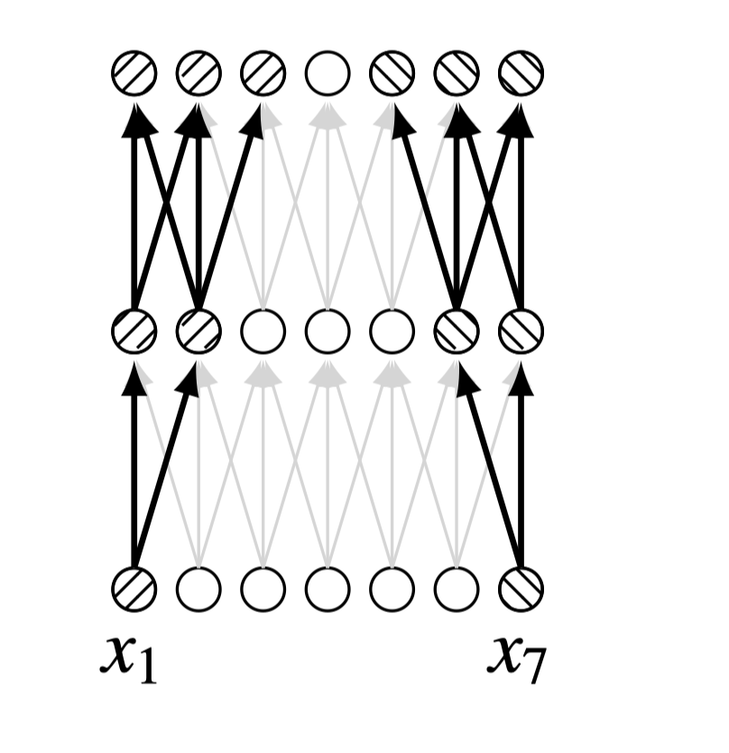
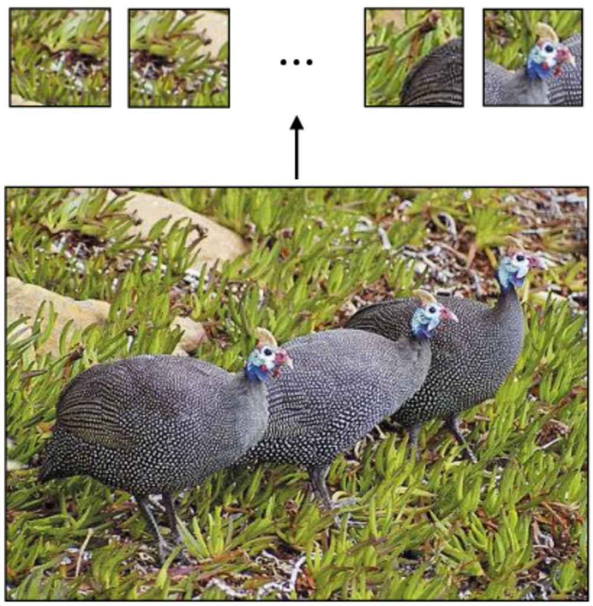
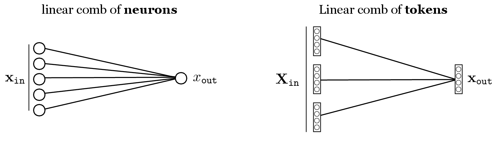
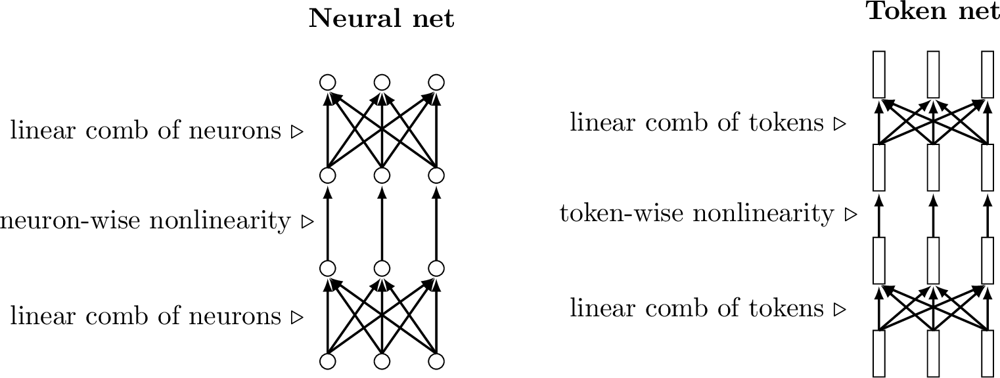
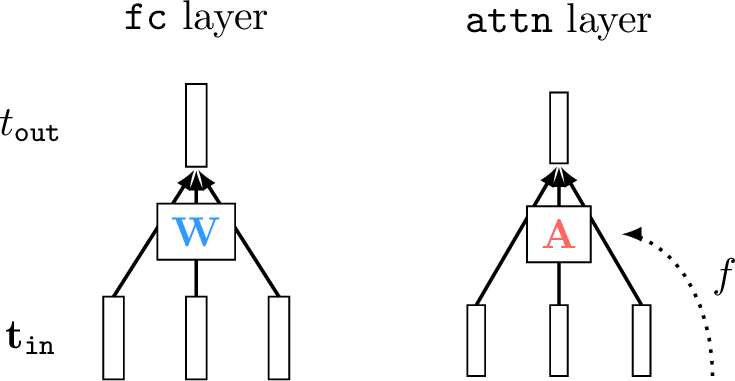
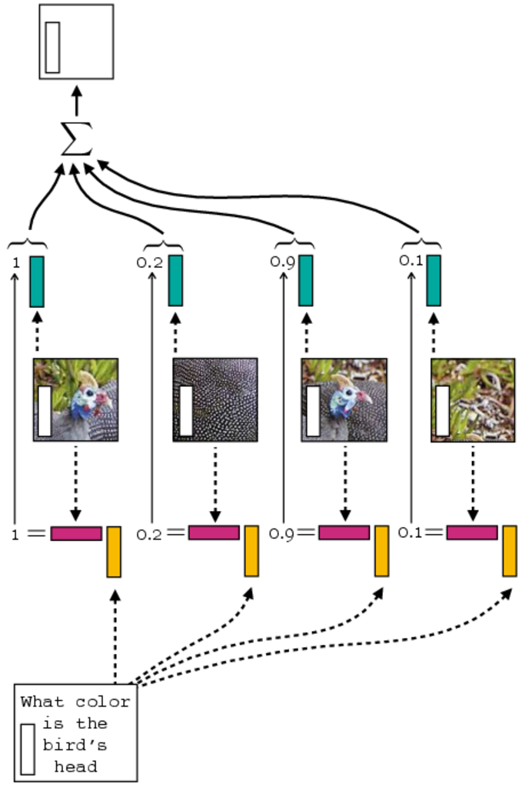
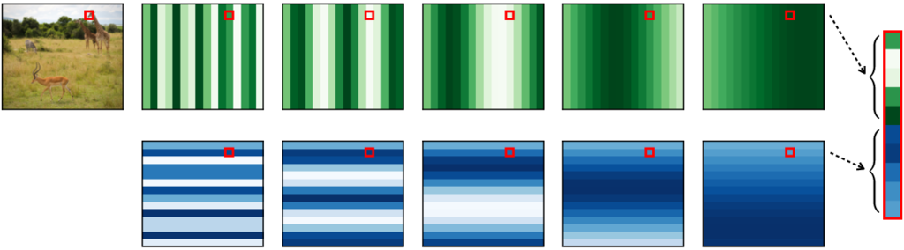

## Introduction

**Transformers** are a family of architectures that generalize and expand ideas from CNNs.

Key innovations:
- **Tokens**: Vectors as fundamental units (vs. individual neurons)
- **Attention layers**: Mix information globally across all regions
- **Parallel processing**: All patches processed together (like CNNs, not like RNNs)

Original work: Vision Transformers (ViTs) | @dosovitskiy2020vit

## Why Transformers? A CNN Limitation

Convolutional networks use *locality*: process regions independently with small kernels.

**Problem:** Comparing distant regions requires either:
- Large kernels (expensive)
- Deep stacks (slow, limited receptive field per layer)

{width=50%}

**Solution:** Global attention mechanisms to efficiently connect distant regions.

## The Core Idea: Attention

**Intuition from human perception:**
- When looking at a scene, we attend to salient elements
- We don't process everything equally
- We focus where needed

**In neural nets:**
- Neurons on layer $\ell+1$ "attend" to select neurons on layer $\ell$
- Each neuron learns what to focus on based on the input

This is efficient—we compute what matters, not everything.

## Introducing Tokens

**Token** = a vector-valued group of neurons (new data type)

- Traditional neural nets: scalars as individual neurons
- Transformers: vectors as fundamental units

**Tokenization:** Convert image patches to token vectors

{width=60%}

Each patch becomes one token. Full image = array of tokens.

## Representing Tokens

**Matrix notation:** A sequence of $N$ tokens, each $d$-dimensional:

$$\mathbf{T} = \begin{bmatrix}
    \mathbf{t}_1^\mathsf{T}\\
    \vdots \\
    \mathbf{t}_N^\mathsf{T}\\
\end{bmatrix} \in \mathbb{R}^{N \times d}$$

**Key insight:** Tokens are to transformers as neurons are to neural nets.

- Neural nets operate on neurons (scalars)
- Transformers operate on tokens (vectors)

## Token Operations: Mixing

**Linear combination of tokens:** Weighted sum of vector-valued tokens

$$\mathbf{T}_{\texttt{out}} = \mathbf{W}\mathbf{T}_{\texttt{in}}$$

Compare with neurons:
$$\mathbf{x}_{\texttt{out}} = \mathbf{W}\mathbf{x}_{\texttt{in}}$$

**The difference:** Weights $\mathbf{W}$ combine tokens (rows), not individual scalars.

{width=65%}

## Token Operations: Modifying

**Per-token nonlinearity:** Apply a nonlinear function to each token independently

$$\mathbf{T}_{\texttt{out}}[i,:] = F_\theta(\mathbf{T}_{\texttt{in}}[i,:])$$

Common choice: $F_\theta$ is an MLP (learnable!)

**Key difference from CNNs:**
- ReLU: no learnable parameters
- Per-token MLP: rich, expressive nonlinearity

This makes tokens more powerful than scalar neurons.

## Token Nets

**Token nets** = computation graphs with tokens as primary nodes

Like neural nets, they alternate:
1. Linear mixing layers (combine tokens)
2. Nonlinear transformation layers (per-token operations)

Key advantage: Tokens allow explicit global communication patterns.

{width=95%}

## Attention: Data-Dependent Mixing

**Standard fc layer:** Weights are fixed parameters

$$\mathbf{T}_{\texttt{out}} = \mathbf{W}\mathbf{T}_{\texttt{in}}$$

**Attention layer:** Weights depend on the input data

$$\mathbf{T}_{\texttt{out}} = \mathbf{A}\mathbf{T}_{\texttt{in}}, \quad \text{where } \mathbf{A} = f(\mathbf{T}_{\texttt{in}})$$

**Why data-dependent?**
- Allocate attention to relevant regions
- Different inputs → different attention patterns
- Learned from data

{width=45%}

## How Attention Works: Query, Key, Value

**Three roles for tokens:**

1. **Query** ($Q$): "What am I looking for?"
2. **Key** ($K$): "What am I?"
3. **Value** ($V$): "What information do I contain?"

**Attention computation:**
$$\text{Attention} = \text{softmax}\left(\frac{QK^\mathsf{T}}{\sqrt{d}}\right) V$$

**Intuition:**
- Queries ask questions
- Keys match queries (similarity score)
- Values provide answers

## Multi-Head Attention

**Single head:** One attention pattern per layer

**Multi-head:** Multiple attention patterns in parallel

- Head 1: Focus on colors
- Head 2: Focus on edges
- Head 3: Focus on texture
- ...

Each head learns different aspects of the image independently, then combine.

{width=70%}

## Positional Encoding

**Problem:** Tokens are permutation-invariant (order doesn't matter to transformer)

**But:** Image patches *do* have spatial order!

**Solution:** Positional encodings encode position information

$$\mathbf{t}_i' = \mathbf{t}_i + \mathbf{p}_i$$

where $\mathbf{p}_i$ encodes the position of token $i$.

{width=65%}

## Transformer Block

**Repeat this pattern** many times:

1. **Multi-head attention** → Global communication
2. **MLP layer** → Per-token nonlinearity  
3. **Residual connections** → Improved learning
4. **Layer normalization** → Stable training

$$\text{Output} = \text{MLP}(\text{Attention}(\text{Input}))$$

Stack dozens of these blocks to build deep transformers.

## Vision Transformer (ViT) Architecture

**Patch embedding** (tokenization)
↓
**Position encoding**
↓
**Stack of transformer blocks** (N layers)
- Multi-head attention
- MLP
- Skip connections & normalization
↓
**Classification head** (or detection/segmentation)

This architecture achieves state-of-the-art results on vision tasks!

## Key Advantages of Transformers

✓ **Global receptive field** from the start (no deep stacking needed)

✓ **Parallel processing** (fast on GPUs)

✓ **Flexible attention** (learns what to focus on)

✓ **Fewer inductive biases** (less hand-crafted structure than CNNs)

✓ **Scales well** with data and model size

## Transformers vs CNNs: Summary

| Aspect | CNN | Transformer |
|--------|-----|-------------|
| Receptive field | Grows with depth | Global from start |
| Processing | Local patches | Global tokens |
| Mixing | Fixed weights | Data-dependent (attention) |
| Inductive bias | Strong (locality) | Weak (flexibility) |
| Efficiency | High (spatial ops) | Lower (quadratic in tokens) |

**When to use which?**
- CNN: Limited data, efficiency critical
- Transformer: Large data, flexibility needed

## Closing Remarks

Transformers represent a paradigm shift in deep learning architecture design.

**Key insight:** Global communication via attention is more flexible than local operations.

This has revolutionized:
- Natural language processing
- Computer vision
- Multimodal learning

And the field is still evolving! 🚀
